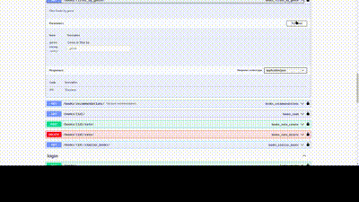

# Recommended Books System

Restful apis for a system that show user a list of books and recommended books by user rating, and similar books (in this project tried to use raw sql instead ORM)

## Features
- JWT Authentication
- Book recommendations based on:
- Genre preferences
- Author preferences
- Similar users
- Vector similarity search using pgvector
- Async task processing with Celery
- API documentation with Swagger
- Environment configuration with python-dotenv
- Mock data generation with Faker

## API Documentation
Access the API documentation at:

Swagger UI: /swagger/
ReDoc: /redoc/


## Tech Stack

**Server:** 
- Python 
- Django 
- Django REST Framework
- Swagger
- Celery 
- sentence-transformers
- PostgreSQL with pgvector
- RabbitMQ
- python-dotenv


## Prerequisites

- PostgreSQL with pgvector extension for vector operations
- RabbitMQ for Celery task queue


### Docker Setup

For PostgreSQL with pgvector:
```bash
docker run --name postgresDB --env POSTGRES_PASSWORD=admin --env POSTGRES_DB=postgres --env POSTGRES_USER=postgres --env POSTGRES_HOST_AUTH_METHOD=trust --publish 5432:5432 --detach ankane/pgvector
```

For RabbitMQ:
```bash
docker run -d -p 5672:5672 rabbitmq
```


## Run Locally

Clone the project

```bash
  git clone https://github.com/sina-mobarez/recommended-books-system.git
```

Go to the project directory

```bash
  cd recommended-books-system
```

Create and activate virtual environment:

```bash
python -m venv .vn
source .vn/bin/activate  # On Linux
```

Install dependencies

```bash
  pip install -r requirements.txt
```
Set up environment variables:

```bash
cp .env.example .env
# Edit .env with your configuration
```

migrate and fill database:

```bash
  python manage.py migrate
  python manage.py setup_db
```

Start the Celery:

```bash
celery -A core worker --loglevel=info --pool=solo
```

Generate embeddings for books:

```bash
  python manage.py vectorize_books
```

Start the Server:

```bash
  python manage.py runserver
```


## Demo




## Contributing

Contributions are always welcome!
You can ask me about this project by email

## License

[MIT](https://choosealicense.com/licenses/mit/)
